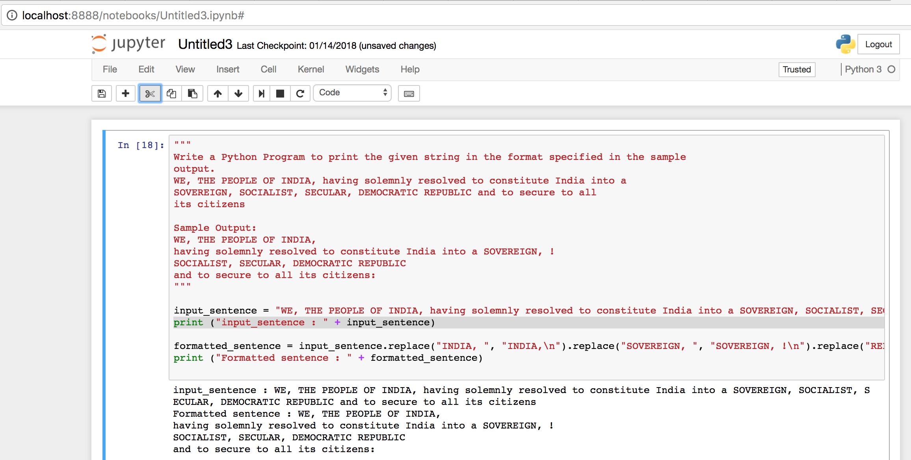
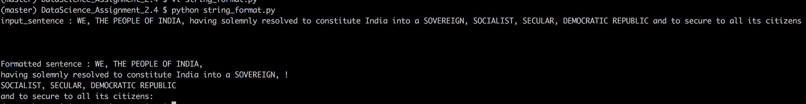

# Problem Statement :
```
Write a Python Program to print the given string in the format specified in the sample
output.
WE, THE PEOPLE OF INDIA, having solemnly resolved to constitute India into a SOVEREIGN, SOCIALIST, SECULAR, DEMOCRATIC REPUBLIC and to secure to all its citizens

Sample Output:
WE, THE PEOPLE OF INDIA,
having solemnly resolved to constitute India into a SOVEREIGN, !
SOCIALIST, SECULAR, DEMOCRATIC REPUBLIC
and to secure to all its citizens:

```

## Snapshot - Run from jupyter REPL 
```
import string_format.ipynb in jupyter REPL 
```




## Snapshot - Run from command line bash
```
Command to execute : python string_format.py
```


